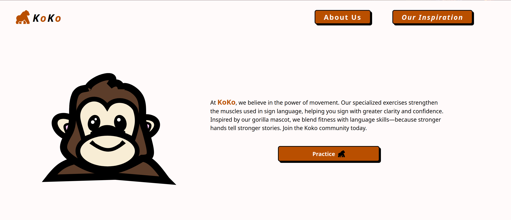
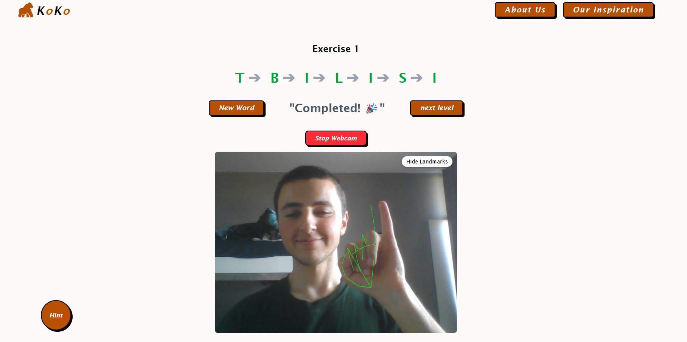
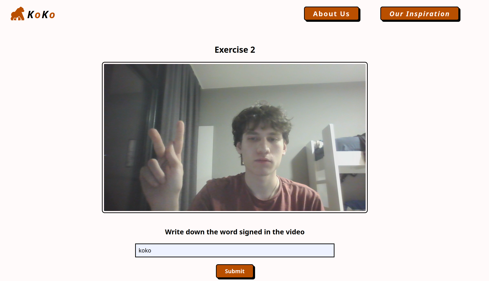

# 🦍 Koko – Learn Sign Language, Empower Communication

**Koko** is an interactive web app that helps people around the world learn **sign language** through a playful, step-by-step experience. Whether you're a beginner or just curious, Koko turns your webcam into a learning companion using **Google MediaPipe** for real-time hand gesture recognition.

> 🌐 **Live now at**: [https://kokolang.site](https://kokolang.site)  
> 📱 No installs. Just visit the site and start learning!

---

## 💡 What is Koko?

Koko is named after the world-famous gorilla who learned sign language — a symbol of empathy, intelligence, and non-verbal connection.  
Our app aims to **celebrate and teach sign language** to bridge communication gaps and build a more inclusive future.

Koko is not just a tool. It's the start of a **movement** — where anyone, anywhere, can learn to communicate beyond words.

---

## 🎯 Our Mission

We’re building Koko as more than just a hackathon project — it’s the **foundation of a startup** that puts **accessibility and empathy** at the center of tech. Our long-term goals include:

- 🌍 Supporting Deaf and Hard of Hearing communities globally
- 👶 Creating kid-friendly and beginner-level learning paths
- 🧠 Building an intelligent feedback system using AI
- 🏫 Partnering with schools and organizations to promote sign language education
- 📈 Expanding to support **multiple sign languages**, with modular lesson plans

We want Koko to be **free, fun, and accessible** to everyone — no matter their background.

---

## ✨ Features

- 📚 **Interactive Lessons** — Progress through bite-sized lessons that gradually increase in difficulty
- 🖐️ **Real-Time Gesture Feedback** — Practice signs live via your webcam, powered by **Google MediaPipe**
- 🧠 **Quizzes and Mini-Games** — Reinforce your learning through gamified experiences
- 🏆 **Progress Tracking and Rewards** — Earn points, unlock levels, and track your journey
- 🦍 **Friendly Mascot (Koko!)** — Learn with encouragement from our animated gorilla guide
- 🌐 **Fully Web-Based** — No installs required. Just open [kokolang.site](https://kokolang.site) and start signing!

---

## 📸 Screenshots

> 🧩 Homepage  


> ✋ Live Gesture Recognition  


> 🧠 Quiz & Feedback  


## 🛠️ Built With

- **Google MediaPipe** – Hand tracking and gesture detection
- **Webcam + Browser APIs** – For a fully online experience
- **React // Vite // TailWind**

---

## 🚀 Getting Started (For Developers)

```bash
# Clone the repository
git clone https://git.kokolang.site/BoysNight/KoKo.git

# Install dependencies
cd koko
npm install

# Run the app
npm start
```

Make sure your device has a **working webcam** for gesture tracking!

---

## 🤝 Join the Mission

We're just getting started. If you believe in making communication accessible, join us!

- 💡 Suggest new features
- 🌍 Help localize into more sign languages
- 🤖 Contribute to better gesture recognition
- 💬 Share your story or feedback with us

Pull requests are welcome, and we’d love to hear from developers, educators, and allies alike.

---

## 📄 License

This project is open source and licensed under the MIT License. See the `LICENSE` file for details.

---

## 📬 Contact & Links

- 🔗 Live App: [https://kokolang.site](https://kokolang.site)
- 🧠 Repo: [https://git.kokolang.site/BoysNight/KoKo](https://git.kokolang.site/BoysNight/KoKo)
- ✉️ Email: contact@kokolang.site

---
